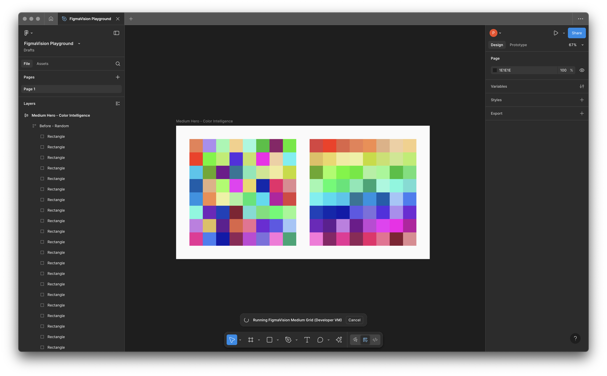

# FigmaVision: Teaching AI to See Its Own Designs

> A system that gives AI assistants visual awareness of their Figma creations, using the official Figma for VS Code integration.




## 🎯 The Problem

AI assistants can manipulate Figma designs programmatically but are "blind" to their visual output. They can set RGB values but can't see if colors harmonize. They can position elements but can't detect overlaps.

## 💡 The Solution

This project combines:
- **[Figma for VS Code](https://help.figma.com/hc/en-us/articles/15023121296151-Figma-for-VS-Code)** - Official Figma editor embedded in VS Code
- **Auto-executing plugins** - Figma plugins that run on file save
- **Visual feedback service** - Captures and analyzes design output
- **Spatial awareness** - Collision detection and smart positioning

## 🎮 Try It Now

**Instant Demo:**
1. Download `figmavision-playground.fig`
2. Open in Figma Desktop
3. Import plugin from `auto-exec/manifest.json`
4. See the perfect Medium hero grid in action!

**One-Command Setup:**
```bash
./START_FIGMAVISION.sh  # Starts everything automatically
```

## 🚀 Quick Start

### Prerequisites
- VS Code with [Figma for VS Code extension](https://marketplace.visualstudio.com/items?itemName=figma.figma-vscode-extension)
- Node.js 18+ and npm
- Figma desktop app (for initial plugin setup)
- macOS (for screen capture features)

### Installation

```bash
# Clone the repository
git clone https://github.com/pslanca/figmavision.git
cd figmavision

# Install Visual Helper dependencies
cd visual-helper
npm install
cd ..
```

### Setup Figma Plugin

1. Open Figma Desktop
2. Go to **Plugins → Development → Import plugin from manifest**
3. Select `auto-exec/manifest.json`
4. The plugin will now auto-execute when you save `code.js`

**Important Note:** The plugin runs in the background without showing a UI. Don't worry if you don't see a plugin window - it's working! Check the console for status messages.

### Start Visual Helper Service

```bash
cd visual-helper
npm start
# Service runs on http://localhost:3001
```

### Use with Figma for VS Code

1. Open VS Code
2. Open any `.fig` file (Figma opens in a tab!)
3. Edit `auto-exec/code.js` in another tab
4. Save to see instant updates in Figma
5. View captures at http://localhost:3001

## 📁 Project Structure

```
figmavision/
├── auto-exec/              # Auto-executing Figma plugin
│   ├── manifest.json       # Plugin configuration
│   └── code.js            # Plugin code (edit this!)
├── visual-helper/         # Visual feedback service
│   ├── server.js         # Express server
│   ├── dashboard.html    # Web UI for captures
│   ├── capture-cli.js    # CLI screenshot tool
│   └── package.json      # Dependencies
└── docs/                  # Documentation
```

## ✨ Key Features

### Auto-Executing Plugin (`auto-exec/`)
- **Background Operation**: Runs silently without UI - check console for logs
- **Collision Detection**: AABB algorithm prevents overlapping elements
- **Smart Positioning**: Finds clear space automatically
- **Document Scanner**: Analyzes entire page structure
- **Visual Export**: Sends designs to helper service
- **Font Management**: Handles font loading gracefully with fallbacks

### Visual Helper Service (`visual-helper/`)
- **Screen Capture**: Full screen or Figma window
- **Real-time Monitoring**: SSE stream for continuous feedback
- **Web Dashboard**: View all captures in browser
- **REST API**: Integration-ready endpoints

## 🎨 Example: Creating a Color Grid

```javascript
// In auto-exec/code.js
async function createColorGrid() {
  // Scan document for existing elements
  const analysis = scanDocument();
  console.log(`Found ${analysis.totalElements} existing elements`);

  // Find clear space for new content
  const position = findClearSpace(800, 400);

  // Create grid at safe position
  const grid = figma.createFrame();
  grid.x = position.x;
  grid.y = position.y;

  // ... create your design

  // Capture visual feedback
  await captureVisualFeedback();
}

createColorGrid();
```

## 🔧 API Reference

### Plugin Functions

```javascript
scanDocument()              // Analyze page structure
findClearSpace(w, h)       // Find non-overlapping position
checkCollision(a, b)       // Detect overlap between bounds
captureVisualFeedback()    // Export as PNG to service
```

### Visual Helper Endpoints

| Endpoint | Method | Description |
|----------|--------|-------------|
| `/` | GET | Dashboard UI |
| `/capture` | POST | Capture screen |
| `/visual-feedback` | POST | Receive Figma exports |
| `/history` | GET | View captures |
| `/monitor` | GET | Live monitoring (SSE) |

## 📖 How It Works

1. **Write Code**: Edit `auto-exec/code.js` in VS Code
2. **Auto-Execute**: Figma detects change and runs plugin
3. **Create Design**: Plugin generates visual elements
4. **Capture Output**: Exports designs as images
5. **Visual Analysis**: Helper service processes captures
6. **Feedback Loop**: AI can now "see" and adjust

## 🤝 Contributing

We welcome contributions! Please:

1. Fork the repository
2. Create a feature branch
3. Make your changes
4. Test thoroughly
5. Submit a pull request

## 📚 Documentation

- [Full Documentation](docs/DOCUMENTATION.md)
- [Medium Article](docs/MEDIUM_ARTICLE.md)
- [Figma Plugin Development](https://www.figma.com/plugin-docs/)
- [Figma for VS Code](https://help.figma.com/hc/en-us/articles/15023121296151-Figma-for-VS-Code)

## 🙏 Acknowledgments

- Figma team for the VS Code integration
- Claude (Anthropic) for being the AI that needed eyes
- The open source community

## 📄 License

MIT License - see [LICENSE](LICENSE) file

---

**Built to give AI assistants eyes in the design world!** 👁️🎨

If this helps your AI see better, please ⭐ the repo!